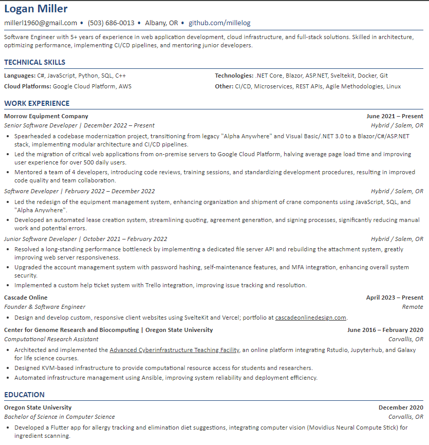

# Resume Management System



## Overview

This Resume Management System is a Python-based tool designed to generate and manage professional resumes. It allows users to maintain their resume data in a structured YAML format and generate a well-formatted HTML resume that can be easily converted to PDF.

## Features

- Store resume data in a structured YAML format
- Generate a professional-looking HTML resume
- Customizable HTML template for resume styling
- Support for multiple resume versions (e.g., for different job applications)
- Automatic date formatting
- Support for including HTML links in resume content

## Project Structure

```
resume-management-system/
├── data/
│   ├── resumes/
│   │   └── logan_miller.yaml
│   ├── letters/
│   │   └── microsoft_software_engineer.yaml
│   └── prompts/
│       └── experience.txt
├── src/
│   ├── generators/
│   │   └── resume_generator.py
│   ├── models/
│   │   └── resume.py
│   └── utils/
│       ├── date_formatter.py
│       └── yaml_handler.py
├── templates/
│   └── resume_template.html
├── scripts/
│   └── generate_resume.py
├── output/
│   └── .gitkeep
├── requirements.txt
└── README.md
```

## Setup

1. Clone the repository:
   ```
   git clone https://github.com/yourusername/resume-management-system.git
   cd resume-management-system
   ```

2. Create and activate a virtual environment:
   ```
   python -m venv .venv
   source .venv/bin/activate  # On Windows, use `.venv\Scripts\activate`
   ```

3. Install the required dependencies:
   ```
   pip install -r requirements.txt
   ```

## Usage

1. Edit your resume data:
   Open `data/resumes/logan_miller.yaml` and update it with your personal information, work experience, education, and skills.

2. Generate your resume:
   ```
   python scripts/generate_resume.py data/resumes/logan_miller.yaml
   ```

3. Generate your cover letter, defaults to most recently added yaml file, otherwise you can specify:
   ```
   python scripts/generate_cover_letter.py
   ```


## Customization

### Resume Content

Edit the YAML file in `data/resumes/` to update your resume content. You can create multiple YAML files for different versions of your resume.

### Resume Template

Modify the `templates/resume_template.html` file to change the layout and styling of your resume. The template uses Jinja2 syntax for dynamic content insertion.

### Python Code

- `src/models/resume.py`: Contains the Pydantic model for the resume data structure.
- `src/generators/resume_generator.py`: Handles the generation of the HTML resume from the YAML data.
- `src/utils/date_formatter.py`: Provides date formatting utilities.
- `src/utils/yaml_handler.py`: Manages YAML file reading and parsing.

## Contributing

Contributions to improve the Resume Management System are welcome. Please follow these steps:

1. Fork the repository
2. Create a new branch (`git checkout -b feature/your-feature-name`)
3. Make your changes
4. Commit your changes (`git commit -am 'Add some feature'`)
5. Push to the branch (`git push origin feature/your-feature-name`)
6. Create a new Pull Request

## License

This project is licensed under the MIT License - see the [LICENSE](LICENSE) file for details.

## Acknowledgments

- [Pydantic](https://pydantic-docs.helpmanual.io/) for data validation
- [Jinja2](https://jinja.palletsprojects.com/) for HTML templating
- [PyYAML](https://pyyaml.org/) for YAML parsing

---

For any questions or issues, please open an issue on the GitHub repository.