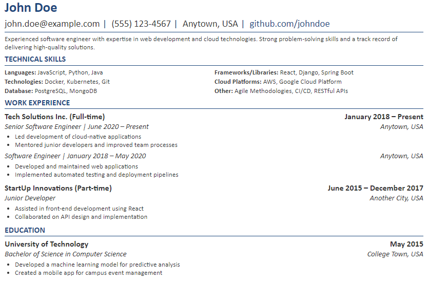

# Resume Management System



## Overview

This Resume Management System is a Python-based tool designed to generate and manage professional resumes. It allows users to maintain their resume data in a structured YAML format and generate a well-formatted HTML resume that can be easily converted to PDF.

## Features

- Store resume data in a structured YAML format
- Generate a professional-looking HTML resume
- Customizable HTML template for resume styling
- Support for multiple resume versions (e.g., for different job applications)
- Automatic date formatting
- Support for including HTML links in resume content

## Project Structure

```
resume-management-system/
├── data/
│   ├── resumes/
│   │   └── main.yaml
│   ├── letters/
│   │   └── microsoft_software_engineer.yaml
│   └── prompts/
│       └── resume.txt
├── src/
│   ├── generators/
│   │   └── resume_generator.py
│   ├── models/
│   │   └── resume.py
│   └── utils/
│       ├── date_formatter.py
│       └── yaml_handler.py
├── templates/
│   └── resume_template.html
├── scripts/
│   ├── generate_cover_letter.py
│   └── generate_resume.py
├── output/
│   └── .gitkeep
├── requirements.txt
└── README.md
```

## Setup

1. Clone the repository:
   ```
   git clone https://github.com/yourusername/resume-management-system.git
   cd resume-management-system
   ```

2. Create and activate a virtual environment:
   ```
   python -m venv .venv
   source .venv/bin/activate  # On Windows, use `.venv\Scripts\activate`
   ```

3. Install the required dependencies:
   ```
   pip install -r requirements.txt
   ```
## Usage

1. Maintain your main resume data:
   Copy `data/resumes/main.yaml.example` to `data/resumes/main.yaml` and keep it updated with your comprehensive personal information, work experience, education, and skills. This serves as your "source of truth" for all resume variations so make it quite extensive.

2. Prepare job-specific resume data:
```plaintext
   a. Obtain the job description for the position you're applying to.
   b. Use an LLM (like ChatGPT) with the prompt found in `data/prompts/resume.txt`.
   c. Provide the LLM with the job description and your `main.yaml` content.
   d. The LLM will generate an optimized YAML for the specific job.
   e. Save this optimized YAML as `data/resumes/job_specific_resume.yaml`.
```
3. Generate your tailored resume:
   ```
   python scripts/generate_resume.py data/resumes/job_specific_resume.yaml
   ```
   If no file is specified, it defaults to the most recently modified YAML file in the resumes directory.


4. Prepare job-specific cover letter data:
```plaintext
   a. Use an LLM with the prompt found in `data/prompts/cover_letter.txt`.
   b. Provide the LLM with the job description and relevant details from your `main.yaml`.
   c. The LLM will generate cover letter content.
   d. Save this content as `data/cover_letters/job_specific_cover_letter.yaml` (see example `data/cover_letters/cover_letter.yaml.example).
```
5. Generate your tailored cover letter:
   ```
   python scripts/generate_cover_letter.py data/cover_letters/job_specific_cover_letter.yaml
   ```
   If no file is specified, it defaults to the most recently modified YAML file in the cover_letters directory.

6. Review and edit the generated HTML files:
   Open the generated HTML files in your browser to review. Make any necessary adjustments directly in the respective YAML files and regenerate if needed.

7. Print to PDF:
```plaintext
   a. Open the final HTML files in a web browser.
   b. Use the browser's print function (usually Ctrl+P or Cmd+P).
   c. Set the destination to "Save as PDF".
   d. Adjust margins if necessary (usually "None" works best).
   e. Save the PDF files of your resume and cover letter.
```
Your tailored resume and cover letter are now ready for submission!

Note: The `data/prompts/` directory contains various prompts for different aspects of the resume and cover letter generation process. Feel free to adjust these prompts to better suit your needs or to generate other job application materials.

## Customization

### Content

Edit the YAML files in `data/resumes/` or `data/cover_letters/` to update your resume and cover letter content. You can create multiple YAML files for different versions.

### Templates

Modify the html files in `templates/` to change the layout and styling of your resume or cover letter. The template uses Jinja2 syntax for dynamic content insertion.

### Python Code

- `src/models/resume.py`: Contains the Pydantic model for the resume data structure.
- `src/generators/resume_generator.py`: Handles the generation of the HTML resume from the YAML data.
- `src/utils/date_formatter.py`: Provides date formatting utilities.
- `src/utils/yaml_handler.py`: Manages YAML file reading and parsing.

## Tracking and Analytics

This system includes a feature to track the source of portfolio visits originating from your resume. Here's how it works:

### Portfolio Link Tracking

- When generating a resume, the system automatically adds a tracking parameter to your portfolio link.
- The parameter format is: `?rs=companyname_jobtitle`
- Example: If applying for a "Senior Developer" position at "TechCorp", your portfolio link might look like:
  ```
  https://your-portfolio.com/?rs=techcorp_seniordeveloper
  ```

### Responsibility Link Tracking

- The system also adds the same tracking parameter to any links in your responsibilities that match your portfolio URL.
- This allows you to track which specific achievements or projects are drawing attention.

### Using the Tracking Data

- Set up your portfolio website to handle these `rs` parameters.
- Use web analytics tools to track visits with these parameters.
- This data can help you understand which job applications are driving traffic to your portfolio and which specific achievements are of most interest to potential employers.

### Privacy Consideration

- Be aware that this tracking method makes your resume tailored to each application.
- Ensure you're comfortable with this level of tracking before using this feature.

To disable this feature, you can modify the `add_tracking_filter` function in `src/utils/add_tracking.py`.

## Contributing

Contributions to improve the Resume Management System are welcome. Please follow these steps:

1. Fork the repository
2. Create a new branch (`git checkout -b feature/your-feature-name`)
3. Make your changes
4. Commit your changes (`git commit -am 'Add some feature'`)
5. Push to the branch (`git push origin feature/your-feature-name`)
6. Create a new Pull Request

## License

This project is licensed under the MIT License - see the [LICENSE](LICENSE) file for details.

## Acknowledgments

- [Pydantic](https://pydantic-docs.helpmanual.io/) for data validation
- [Jinja2](https://jinja.palletsprojects.com/) for HTML templating
- [PyYAML](https://pyyaml.org/) for YAML parsing

---

For any questions or issues, please open an issue on the GitHub repository.